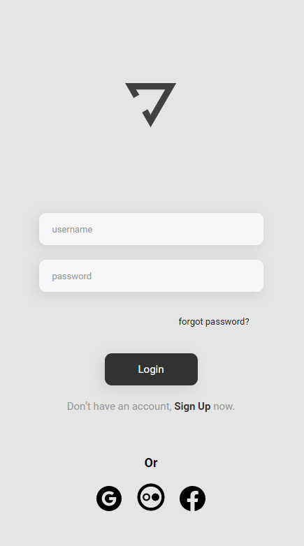

<h1>🧘🏻 Yoga Interface</h1>

With a simple and minimalist layout, an interface was created for the user to login to a yoga website.

##
### 🚀 Technologies
 
This project was developed with the following technologies:

- <a href="https://en.wikipedia.org/wiki/HTML">Html</a>
- <a href="https://en.wikipedia.org/wiki/CSS">Css</a>
- <a href="https://code.visualstudio.com/">Vs code</a>

##
### 📝 License

This project is open to the public, to access and test.

If you want to test <a href="https://gabrielprt.github.io/yoga-interface/">click here</a> 🎯

Created by 😁 Gabriel Prates 👋 <a href="https://github.com/GabrielPrt">Get in touch!</a>
 
